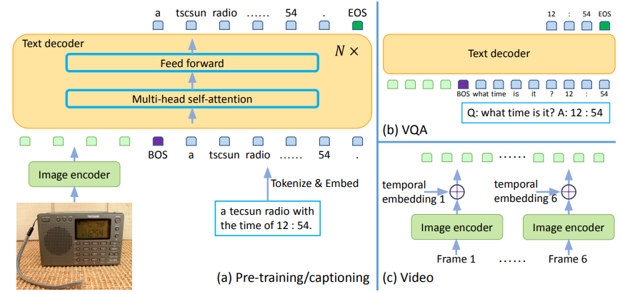
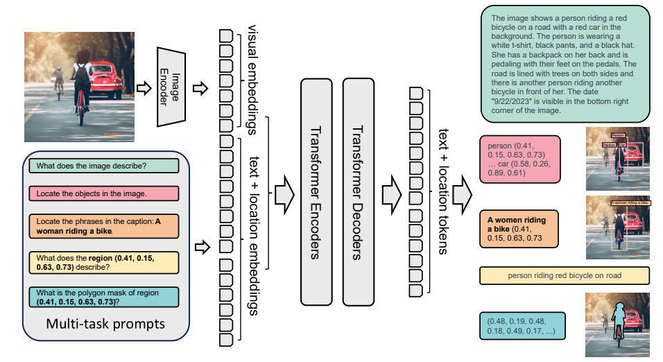
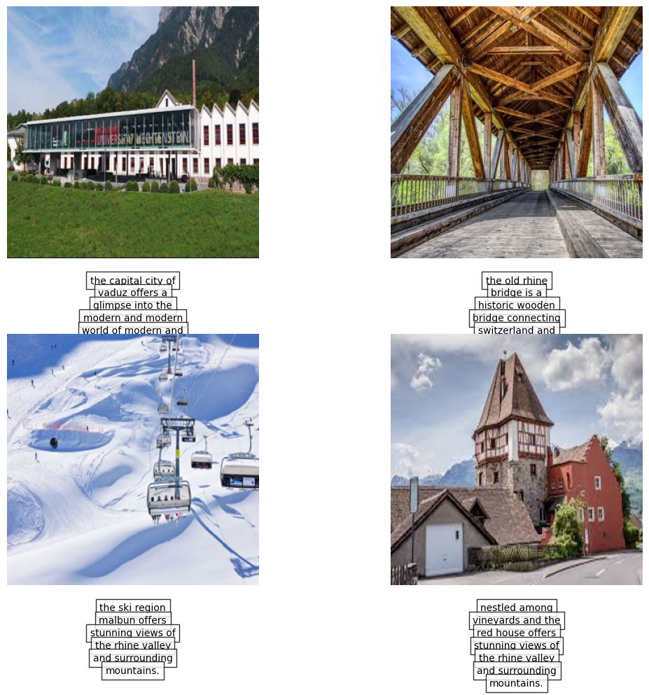
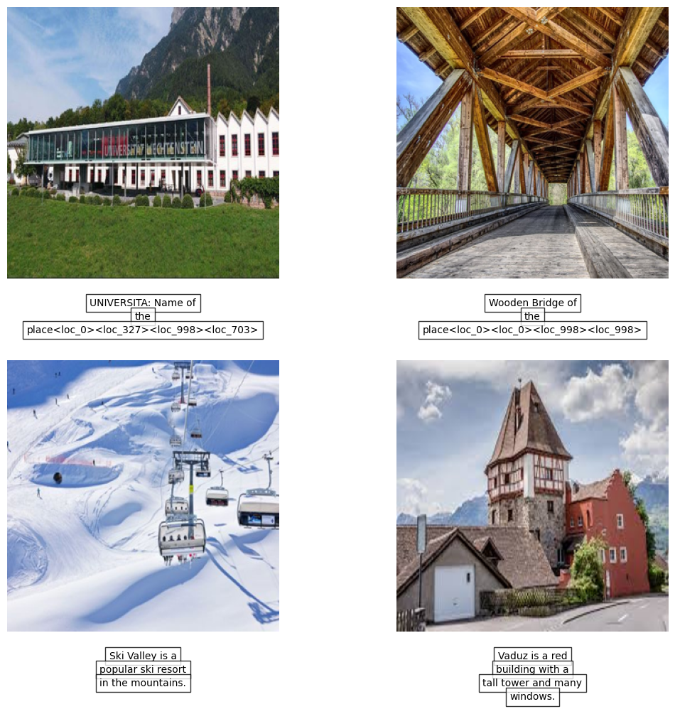

# Fine-Tuning Image-to-Text Models on Liechtenstein Tourist Attractions Using Microsoft GIT and Florence-2 Models: A Transfer Learning Approach with Model Tracking in Weights & Biases

## Authors:
- **Pejman Ebrahimi**  
  Department of Information Systems & Computer Science, University of Liechtenstein  
  Email: pejman.ebrahimi@uni.li  

- **Johannes Schneider**  
  Department of Information Systems & Computer Science, University of Liechtenstein  
  Email: johannes.schneider@uni.li  

## Introduction
* In this study, we fine-tune two advanced models, Microsoft GIT and Microsoft Florence-2, for image captioning and visual question answering (VQA) tasks using small custom datasets related to Liechtenstein tourist attractions. The goal is to evaluate how transfer learning can adapt these models to domain-specific tasks.

## Problem Statement and Previous Research
* While transformer models like GIT and Florence-2 have shown great potential in multi-modal tasks, there is limited research on their fine-tuning for small, niche datasets. This study bridges that gap by fine-tuning these models on Liechtenstein tourist attractions datasets.

## Methodology
We used two datasets for fine-tuning:
- [Liechtenstein Tourist Attractions Dataset](https://huggingface.co/datasets/arad1367/Liechtenstein_tourist_attractions)
- [Liechtenstein Tourist Attractions VQA Dataset](https://huggingface.co/datasets/arad1367/Liechtenstein_tourist_attractions_VQA)

### Data Preprocessing
- **GIT Model**: Text and image pairs are preprocessed using a custom PyTorch dataset and a data loader. Image-text pairs are converted using a specialized processor for the GIT model.
- **Florence-2 Model**: Images, questions, and answers are processed similarly, with custom dataset classes to handle the VQA triplets.

### Fine-Tuning
- Both models are initialized with pre-trained weights. A forward pass was performed to ensure proper setup. The batch size for both models was set to 6 to accommodate GPU memory limitations.
- **Evaluation**: The models were evaluated using `BLEU`, `CIDEr`, and `ROUGE metrics`.

### GPU Memory
* Memory requirements were calculated to ensure efficient fine-tuning even on limited hardware.

## GIT Model
The **Microsoft GIT** model is a transformer decoder conditioned on both CLIP image tokens and text tokens. It predicts the next text token based on the image and previous text tokens.

For more details, check the [GIT model on Hugging Face](https://huggingface.co/arad1367/Microsoft-git-base-Liechtenstein-TA).

## Florence-2 Model
**Florence-2** is a vision foundation model with a prompt-based approach that handles tasks like captioning, object detection, and segmentation. It excels in both zero-shot and fine-tuned tasks due to its sequence-to-sequence architecture and multi-task learning using the FLD-5B dataset.

### Florence-2 Model Variants
| Model                 | Size  | Description                                      |
|-----------------------|-------|--------------------------------------------------|
| Florence-2-base[HF]    | 0.23B | Pretrained model with FLD-5B                     |
| Florence-2-large[HF]   | 0.77B | Pretrained model with FLD-5B                     |
| Florence-2-base-ft[HF] | 0.23B | Fine-tuned model on a collection of tasks        |
| Florence-2-large-ft[HF]| 0.77B | Fine-tuned model on a collection of tasks        |

For more details, check the [Florence-2 model on Hugging Face](https://huggingface.co/arad1367/Florence-2-Liechtenstein-TA-OCR-VQA-modified).

## Results and Predictions
### GIT Model Predictions
We tested the fine-tuned GIT model on custom images. The model correctly predicted most of the landmarks, except for the University of Liechtenstein image.

### Florence-2 Model Predictions
Using the same custom images, we asked the Florence-2 model to identify and describe the landmarks. The model correctly identified most landmarks but failed to fully recognize "Liechtenstein Universität."

### Known Issue with Florence-2 Model
Upon pushing the Florence-2 model to Hugging Face, we encountered an error related to the model’s architecture, which was based on DaViT. The issue was resolved by updating the `config.json` file to include the correct `vision_config` parameter. You can review the [config.json file here](https://huggingface.co/arad1367/Florence-2-Liechtenstein-TA-OCR-VQA-modified/blob/main/config.json).

## Links to Hugging Face Resources
- [Liechtenstein Tourist Attractions Dataset](https://huggingface.co/datasets/arad1367/Liechtenstein_tourist_attractions)
- [Liechtenstein Tourist Attractions VQA Dataset](https://huggingface.co/datasets/arad1367/Liechtenstein_tourist_attractions_VQA)
- [Fine-Tuned GIT Model](https://huggingface.co/arad1367/Microsoft-git-base-Liechtenstein-TA)
- [Fine-Tuned Florence-2 Model](https://huggingface.co/arad1367/Florence-2-Liechtenstein-TA-OCR-VQA-modified)

## Acknowledgements
- This research is conducted under the Department of Information Systems & Computer Science, University of Liechtenstein. 
- The authors thank [Weights & Biases](https://wandb.ai) for enabling model tracking during the fine-tuning process.
- The authors thank [Hugging Face](https://huggingface.co) for sharing open source models.

## Contact
- **Pejman Ebrahimi**: pejman.ebrahimi@uni.li
- **Johannes Schneider**: johannes.schneider@uni.li
